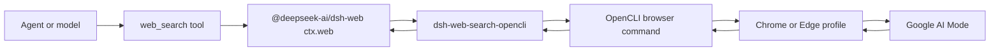

# dsh-web-search-opencli architecture

`dsh-web-search-opencli` is a DeepSeek Harness web search provider. It does not start a daemon or expose an HTTP service. DSH loads it as a Cordis plugin inside the existing web profile.

## Runtime flow

## Cordis plugin

`src/index.ts` exports the Cordis plugin:

- `name = 'dsh-web-search-opencli'` for loader diagnostics;
- `inject = ['web']` so the plugin receives the DSH web capability;
- `Config` for provider id, OpenCLI command/session/window mode, timeout, and optional tab cleanup;
- `apply(ctx, config)`, which registers `GoogleAiModeSearchProvider` through `ctx.web.registerSearchProvider()`.

The bundle patch selects `google-ai-mode` as the DSH web `searchProvider` and inserts this plugin with matching `providerId`.

## Search provider

`GoogleAiModeSearchProvider` implements DSH's `WebSearchProvider` interface.

For each search:

1. Build `https://www.google.com/search?udm=50&q=<query>`.
2. Run `opencli browser <session> --window <mode> open <url>`.
3. Wait for Google AI Mode's main column.
4. Wait for answer text to stabilize.
5. Probe the page for CAPTCHA or unusual-traffic pages.
6. Evaluate the extraction script.
7. Convert the extracted answer HTML to markdown.
8. Normalize cited source URLs.
9. Return DSH `WebSearchResult` with `content`, `sources[]`, and `truncated: false`.

The provider passes both `OPENCLI_WINDOW` and OpenCLI `--window` so the configured window mode is applied consistently. It reuses the OpenCLI automation tab by default. `closeTabAfterSearch` enables best-effort cleanup after the result or error is produced.

## Extraction pipeline

`src/extract.ts` owns Google AI Mode page extraction and conversion:

- `buildGoogleAiModeUrl()` creates the AI Mode search URL;
- the browser-side extraction script reads the AI Mode answer area and citation/link nodes;
- Google redirect URLs such as `/url?...&url=https%3A%2F%2Fexample.com` are decoded;
- duplicate source URLs are collapsed in first-use order;
- answer HTML is converted to markdown for model-visible output.

## Error mapping

The provider converts expected failure modes into DSH `WebError` codes:

| Code | Meaning |
| --- | --- |
| `WEB_ABORTED` | The DSH request was cancelled. |
| `WEB_SEARCH_OPENCLI_CAPTCHA` | Google showed CAPTCHA or unusual-traffic content. |
| `WEB_SEARCH_OPENCLI_AI_MODE_UNAVAILABLE` | AI Mode is unavailable for the browser account, region, or locale. |
| `WEB_SEARCH_OPENCLI_TIMEOUT` | The configured timeout elapsed. |
| `WEB_PROVIDER_ERROR` | OpenCLI failed or extraction returned unexpected data. |

## Package and distribution

`package.json` declares:

- ESM entry points under `lib/`;
- `dsh.bundle.patch` pointing at `cordis.patch.yml`;
- npm files for `lib`, README, LICENSE, and the bundle patch;
- `dsh-plugin`, `deepseek-harness`, and related keywords for discovery.
